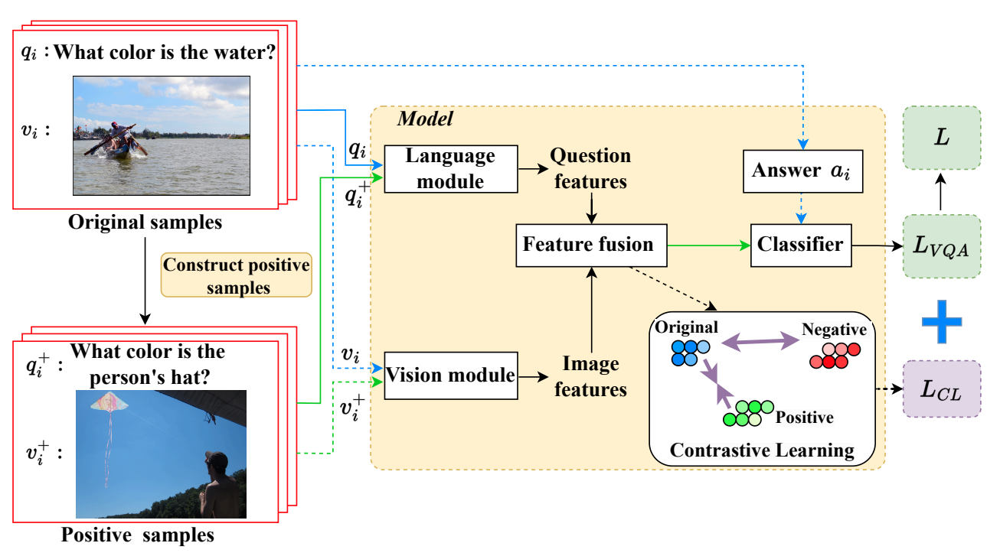

# CLAP: Overcoming Language Priors via Contrastive Learning and Answer Perturbation

This repo contains code for our paper "CLAP: Overcoming Language Priors via Contrastive Learning and Answer Perturbation".

This repo contains code modified from [here](https://github.com/yanxinzju/CSS-VQA), many thanks!

## Prerequisites

1. The required **data** folder and the data in the **new_data** folder need to be obtained from [our modified warehouse](https://github.com/yanxinzju/CSS-VQA).

2. Please refer to [our modified warehouse](https://github.com/yanxinzju/CSS-VQA) for the software package version.

## Structure



## Training

```python
python main.py --dataset cpv2 --debias learned_mixin --score 0.3 --batch 512
```

## Others

1. If you need a visual evaluation, get the code from the [gge warehouse](https://github.com/GeraldHan/GGE).

2. Contrastive Learning code from [mmbs warehouse](https://github.com/PhoebusSi/MMBS), thank you!
